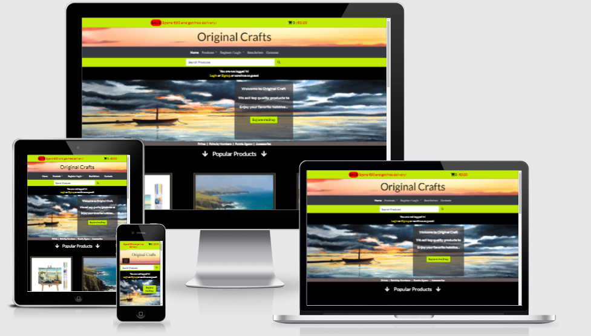
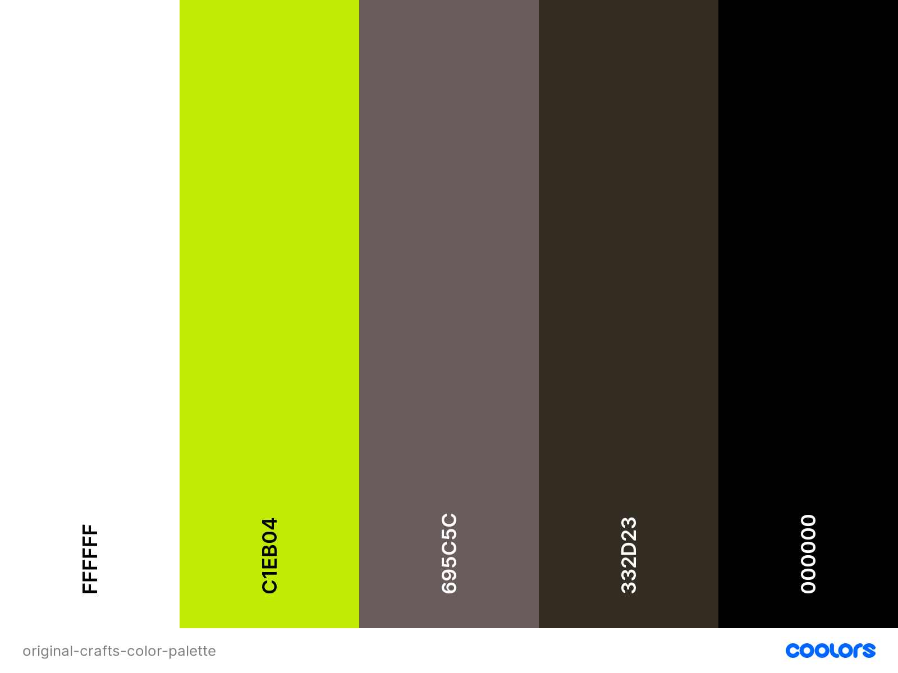

***
# Original Crafts
***

### Project Description  
Original Craft is a ecommerce website that sells Art and Crafts products: jigsaw, prints, paint-by-number kits and art and crafts accessories (brushes, colors, frames...). The website also have original designs from a private gallery. The products are divided in different categories and Original sections. The Original section contains prints, jigsaw and paint-by-numbers kits made the original gallery. The user can click on a product on the list to see the details, add the product to cart, check his/her proofile page. The user can leave edit delate reviews about the products in his/her purchase history.  

---
  

---

 ## Content:
> [Website Structure](#website-structure)  
> [User Stories](#user-stories)  
> [Database Structure](#database-structure)  
> [Database Schema](#database-schema)   
> [Design Choices](#design-choices)  
> [Wireframes](#wireframes)  
> [Technologies Used](#technologies-used)  
> [Implemented Features](#implemented-features)  
> [Future Features](#future-features)  
> [Testing](#testing)  
> [Bugs](#bugs)  
> [Deployment](#deployment)  
> [Credits](#credits)  
> [Acknowledgements](#acknowledgement)  

## Website Structure
The website is a composed of an homepage that allow the user to register or login to their account. On the homepage the user is informed that there is a free delivery deal for oders over 50 euro. Some of the popular products are displayed in the homepage to show user which type of products are available.  
The navigation bar is present in all pages accross the website for a consistent and a smooth user experience.  
After the user perform the search is possible to click on the products to see the product details, add it to cart and complete the purchase in the checkout page.  
Is possible to complete a purchase even for not registered users.  
Messages are displayed accross the website following different user actions to inform customers on their action's results inproving the user experience.  The payment is allow using credit cards and stripe.  
Registered customers can also check their purchase history and leave reviews on products they bought.  
See the [Website Map](./static/docs/website-map.png)  

## User Stories  

Find user stories in a separate document [user-stories.md](./static/docs/user-stories.md)  

## User Actions  
The user can perform the following actions:  
1. Login  
1. Logout  
1. Register  
1. Search for products by category  
1. Search for products by keywords  
1. Select product to see details  
1. Add product to cart  
1. Proceed to checkout page
1. Enter delivery details
1. Save delivery details to his/her profile  
1. Finalize order entering a valid credit card details    
1. Log in the his/her account  
1. Edit delivery details stored in his/her profile  
1. Check purchase history in the profile page  
1. Add, edit or remove reviews of purchased products  
1. Use the contact form to send enquiry to Original Crafts  

Admin users can access admin functionality:
1. Manage products in the database (create - edit - delete) 
1. Manage users details (create - edit - delete)
1. Manage orders (create - edit - delete)
1. Login to django admin interface by clicking Admin Site link in the navigation bar

## Database Structure  
 
For this project I used a relational database. I build a custom profiles table to extend django user table with extra fields with a one to one relation.  
The category table is related to the products with the category fields.  
Order_line_items table connects products table to the checkout order table product field.  
Users profiles tables have a one to many relation with checkout orders table as one user can have many orders and the order can only have one user.  
The review table is related to users as author and the products table. In this case the many to many relation as a user can review many products and a product can be review from many users.  
The contacts table is not related to other tables as is possible for not registered users to enquiry and use the contact form in the website. It is useful for the admin to keep a record of the received email.
   
## Database Schema  
  

--- 

## Design Choices 
I have chosen Lato font for the whole website.  

The color palette was created with [Coolors.co](https://coolors.co/)  

   

--- 

## Wireframes  

## Technologies Used  

## Implemented Features  

## Future Features  

## Testing  

## Bugs 
 
## Deployment

## Credits  

## Acknowledgements