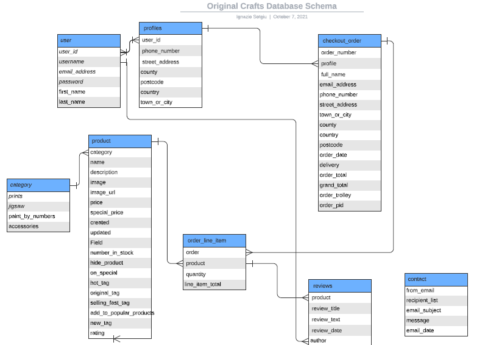

***
# Original Crafts
***

### Project Description  
Original Craft is a ecommerce website that sells Art and Crafts products: jigsaw, prints, paint-by-number kits and art and crafts accessories (brushes, colors, frames...). The website also have original designs from a private gallery. The products are divided in different categories and Original sections. The Original section contains prints, jigsaw and paint-by-numbers kits made the original gallery. The user can click on a product on the list to see the details, add the product to cart, check his/her proofile page. The user can leave edit delate reviews about the products in his/her purchase history.  

---
  

---

 ## Content:
> [Website Structure](#website-structure)  
> [User Stories](#user-stories)  
> [Database Structure](#database-structure)  
> [Database Schema](#database-schema)   
> [Design Choices](#design-choices)  
> [Wireframes](#wireframes)  
> [Technologies Used](#technologies-used)  
> [Implemented Features](#implemented-features)  
> [Future Features](#future-features)  
> [Testing](#testing)  
> [Bugs](#bugs)  
> [Deployment](#deployment)  
> [Credits](#credits)  
> [Acknowledgements](#acknowledgement)  

## Website Structure
The website is a composed of an homepage that allow the user to register or login to their account. On the homepage the user is informed that there is a free delivery deal for oders over 50 euro. Some of the popular products are displayed in the homepage to show user which type of products are available.  
The navigation bar is present in all pages accross the website for a consistent and a smooth user experience.  
After the user perform the search is possible to click on the products to see the product details, add it to cart and complete the purchase in the checkout page.  
Is possible to complete a purchase even for not registered users.  
Messages are displayed accross the website following different user actions to inform customers on their action's results inproving the user experience.  The payment is allow using credit cards and stripe.  
Registered customers can also check their purchase history and leave reviews on products they bought.  
See the [Website Map](./static/docs/website-map.png)  

## User Stories  

Find user stories in a separate document [user-stories.md](./static/docs/user-stories.md)  

## User Actions  
The user can perform the following actions:  
1. Login  
1. Logout  
1. Register  
1. Search for products by category  
1. Search for products by keywords  
1. Select product to see details  
1. Add product to cart  
1. Proceed to checkout page
1. Enter delivery details
1. Save delivery details to his/her profile  
1. Finalize order entering a valid credit card details    
1. Log in the his/her account  
1. Edit delivery details stored in his/her profile  
1. Check purchase history in the profile page  
1. Add, edit or remove reviews of purchased products  
1. Use the contact form to send enquiry to Original Crafts  

Admin users can access admin functionality:
1. Manage products in the database (create - edit - delete) 
1. Manage users details (create - edit - delete)
1. Manage orders (create - edit - delete)
1. Login to django admin interface by clicking Admin Site link in the navigation bar

## Database Structure  
 
For this project I used a relational database. I build a custom profiles table to extend django user table with extra fields with a one to one relation.  
The category table is related to the products with the category fields.  
Order_line_items table connects products table to the checkout order table product field.  
Users profiles tables have a one to many relation with checkout orders table as one user can have many orders and the order can only have one user.  
The review table is related to users as author and the products table. In this case the many to many relation as a user can review many products and a product can be review from many users.  
The contacts table is not related to other tables as is possible for not registered users to enquiry and use the contact form in the website. It is useful for the admin to keep a record of the received email.
   
## Database Schema  
  

--- 

## Design Choices 
I have chosen Lato font for the whole website.  

The color palette was created with [Coolors.co](https://coolors.co/)  

   

--- 

I have chosen a dark background color for the website to increase visibility of products design.  

## Wireframes  

The wireframes were done using [Balsamiq](https://balsamiq.com/)  

See the wireframes [here](./static/docs/wireframes-original-crafts.md)
## Technologies Used  

### Languages:
* HTML to create elements in the page
* CSS to style elements in the page  
* Python to add functionality to the website and interaction with database
* JavaScript to add elements functionality  

Used django full stack framework to build the ecommerce website  

### Libraries
* Bootstrap to style the elements
* Google Fonts for Lato font
* Font Awesome for the icons
* JQuery  

### Tools
* Github - Used for version control
* Gitpod.io workspace - Used to develop the project and push versions to the Github repository
* Chrome developer tool
* Microsoft word - For user stories and strategy plane sheets
* Balsamiq - For wireframes
* Bootstrap toasts - To display messages
* Coolors - Used to create a color palette
* Am I responsive - used to create Original Crafts mockup image
* Heroku - To deploy the project online
* Heroku postgres - database in production  
* AWS s3 storage - to store static files and media files for the production website  
* Stripe - To allow secure payments when purchasing products  
* [Lucid App](https://lucid.app/documents#/dashboard) to build the database schema  
* Google Gmail Service - to send emails with python  

## Implemented Features  
1. Registered and unregistered users can purchase products from the website  
1. Users can register to the website  
1. Users can login to the website  
1. Users can securely logout from the website  
1. Users can search products by keywords or selecting a product category  
1. Users can add the product they want to purchase to the cart
1. Users can access the cart to check the products, prices, delivery charges, subtotal and grand total
1. Users can edit the cart, update product quantity or remove products from cart  
1. User can reset password if needed
1. Registered users can access their profile and check their purchase history  
1. Registered users can review products in their purchase history  
1. Registered users can edit add or remove reviews they have made  
1. Information messages are displayed following user's actions to improve the user experience
1. Secure payment method was implemented using Stripe  
1. A confirmation email containing the order number is sent to user after successful purchase  
1. Registered users can save their delivery information to their profile  
1. Registered users can edit their delivery information in their profile page  
1. A calculator helps the users by updating totals and delivery costs during the shopping experience
1. Add reviews (if any) to the single product page  
1. Add admin dashboard for administrator users to manage the website 

## Future Features  
1. Sort products by price  
1. Add FAQ section  
1. Allow users to rate products and add rating to products  
1. Allow users to register to  the website via social media accounts or Google account

## Testing 

PEP8 online, JSHint, W3C Markup Validation Service and CSS Validation Service were used to validate all project pages.

Find the testing information in a separate file:  
[User Acceptance Test](./static/docs/user-acceptance-test-original-crafts.pdf)

Testing was also done in the applications with django test covering 84% of the code

## Bugs  

Here the bugs found during the development and testing of the website:  

The following steps were used when the bug was found:

1. Following the steps to trigger and report the bug:

    * Give a short description of the problem
    * Steps to trigger the bug:
    * Click the element
    * What expect to happen
    * What happened instead?
1. Description of the unwanted behaviour.
1. Solution found if the problem was solved  

List of bugs found in separate file [bugs.md](./static/docs/bugs.md)  

## Deployment
Original Crafts app was developed using gitpod.io workspace, using git push to push changes to the GitHub repository.  
The website is live in Heroku and automatic deployment from github is enabled.  
This is the procedure to follow to deploy Original Crafts to Heroku:  
1. Go to gitpod.io original-crafts workspace and create a requirement.txt file. This contains the applications and dependencies required to run original-crafts. In the terminal enter the following command:  
pip3 freeze --local > requirements.txt 
1. Create a Procfile to tell Heroku which file runs the app, Enter in the terminal the following command:  
1. Go to Heroku.com
1. Log in to Heroku 
1. Click create a new app on the top right of the screen  
1. Enter original-crafts as name app  
1. Select Europe as the region
1. Click create app  
1. Click on the resources tab to the top of the page  
1. Search for Heroku postgres database to add on 
1. Add Heroku postgres to the app
1. Click connect to github to setup automatic deployment from original-crafts repository  
1. Select original-crafts and click search
1. Once if find the repository click connect
1. Scroll back to the top of the page and click on settings  
1. On the settings page click on reveal config vars  
1. add the following configurations vars:  
    * AWS_ACCESS_KEY_ID - Provided by Amazon Web Services  
    * AWS_SECRET_ACCESS_KEY - Provided by Amazon Web Services 
    * DATABASE_URL  - Postgres database key provided by Heroku
    * EMAIL_HOST_PASSWORD  - Provided by Google Gmail 
    * EMAIL_HOST_USER  - Your email host user
    * SECRET_KEY - Django secret key 
    * STRIPE_PUBLIC_KEY  - Provided by Stripe
    * STRIPE_SECRET_KEY  - Provided by Stripe
    * USE_AWS  - set to true to use AWS bucket in production
    * WEBHOOK_ENDPOINT_SECRET - Provided by Stripe
1. Click the deploy link on the top of the page  
1. Go back to gitpod.io original-crafts workspace and commit and push requirements.txt and Procfile to the repository  
1. In your gitpod.io terminal login to heroku with the command - heroku login -i
1. Enter your Heroku registration email
1. Enter your Heroku Password  
1. Apply migrations to heroku app with the command - heroku run python manage.py migrate
1. Go back to Heroku deploy tab  
1. Click enable automatic deployments
1. Click deploy branch
1. Heroku will receive data from github repository and build the app  
1. A message is displayed: Your app was successfully deployed  
1. Click view to launch original-crafts app  
1. The app is deployed and live in Heroku:  
https://original-crafts.herokuapp.com/

The app will automatic deploy the changes pushed on GitHub repository  

## Running Build Connected Locally
1. Navigate to Github.com
1. Navigate to "IgnazioSotgiu/original-crafts" repository
1. Click on "IgnazioSotgiu/original-crafts" to open the repository
1. Click on the Code button
1. Select copy the URL in the dropdown menu
1. Open your favourite IDE and enter the command: git clone https://github.com/IgnazioSotgiu/original-crafts.git
1. Then you can navigate through the repository files  
1. Check requirements.txt to see which dependancies are needed to run the application
1. Add environment variables in your settings to securely store variables in development

To clone the repository input this command: git clone https://github.com/IgnazioSotgiu/original-crafts.git  
## Credits 

### Images

Stag's head - Photo by <a href="https://unsplash.com/@chrishcush?utm_source=unsplash&utm_medium=referral&utm_content=creditCopyText">Christian Bowen</a> on <a href="https://unsplash.com/s/photos/ireland?utm_source=unsplash&utm_medium=referral&utm_content=creditCopyText">Unsplash</a>
County Kerry - Photo by <a href="https://unsplash.com/@anikinearthwalker?utm_source=unsplash&utm_medium=referral&utm_content=creditCopyText">Dimitry Anikin</a> on <a href="https://unsplash.com/s/photos/ireland?utm_source=unsplash&utm_medium=referral&utm_content=creditCopyText">Unsplash</a>
Rock of Cashel - Photo by <a href="https://unsplash.com/@kmitchhodge?utm_source=unsplash&utm_medium=referral&utm_content=creditCopyText">K. Mitch Hodge</a> on <a href="https://unsplash.com/s/photos/ireland?utm_source=unsplash&utm_medium=referral&utm_content=creditCopyText">Unsplash</a>
Dingle Peninsula - Photo by <a href="https://unsplash.com/@proine?utm_source=unsplash&utm_medium=referral&utm_content=creditCopyText">Proinsias Mac an Bheatha</a> on <a href="https://unsplash.com/s/photos/ireland?utm_source=unsplash&utm_medium=referral&utm_content=creditCopyText">Unsplash</a>
Killarney National Park - Photo by <a href="https://unsplash.com/@mrmarkdejong?utm_source=unsplash&utm_medium=referral&utm_content=creditCopyText">Mark de Jong</a> on <a href="https://unsplash.com/s/photos/ireland?utm_source=unsplash&utm_medium=referral&utm_content=creditCopyText">Unsplash</a>
Dublin - Photo by <a href="https://unsplash.com/@saturday_sun?utm_source=unsplash&utm_medium=referral&utm_content=creditCopyText">.</a> on <a href="https://unsplash.com/s/photos/ireland?utm_source=unsplash&utm_medium=referral&utm_content=creditCopyText">Unsplash</a>
Cobh - Photo by <a href="https://unsplash.com/@camila_waz?utm_source=unsplash&utm_medium=referral&utm_content=creditCopyText">camila waz</a> on <a href="https://unsplash.com/s/photos/ireland?utm_source=unsplash&utm_medium=referral&utm_content=creditCopyText">Unsplash</a>
Doolin Doonagore Castle - Photo by <a href="https://unsplash.com/@plasticmind?utm_source=unsplash&utm_medium=referral&utm_content=creditCopyText">Jesse Gardner</a> on <a href="https://unsplash.com/s/photos/ireland?utm_source=unsplash&utm_medium=referral&utm_content=creditCopyText">Unsplash</a>
Kylemore Abbey - Photo by <a href="https://unsplash.com/@jamiesongordon?utm_source=unsplash&utm_medium=referral&utm_content=creditCopyText">Jamieson Gordon</a> on <a href="https://unsplash.com/s/photos/ireland?utm_source=unsplash&utm_medium=referral&utm_content=creditCopyText">Unsplash</a>
Cliffs of Moher - Photo by <a href="https://unsplash.com/@anikinearthwalker?utm_source=unsplash&utm_medium=referral&utm_content=creditCopyText">Dimitry Anikin</a> on <a href="https://unsplash.com/s/photos/ireland?utm_source=unsplash&utm_medium=referral&utm_content=creditCopyText">Unsplash</a>

Other product images where taken with Google search

### Tutorials
* [How to Build an E-commerce Website with Django and Python](https://www.youtube.com/watch?v=YZvRrldjf1Y)  
* [Visiture](https://www.visiture.com/blog/10-features-your-ecommerce-store-must-have-to-succeed/) - Important to have in ecommerce website  
* [Python Django Project - Ecommerce Store (2021) - Part 1 - Building models, views and testing](https://www.youtube.com/watch?v=UqSJCVePEWU)  
* [Build an Ecommerce Website with Django // Part 5 - The checkout process](https://www.youtube.com/watch?v=UyML8q-8B1s)
* For the testing: https://usersnap.com/blog/user-acceptance-testing-example/ https://usersnap.com/blog/user-acceptance-testing-right/  
* The user acceptance testing template was taken from:
    - [usersnap website](https://usersnap.com/)
    - [Tutorial Example](https://usersnap.com/blog/user-acceptance-testing-right/)

* Stack Overflow page
### books  
* Book - Django for Beginners: Build Websites with Python and Django  -  William S. Vincent 
* Book - Django for Professionals: Production websites with Python & Django - William S. Vincent  

## Acknowledgements

I receive inspiration and guidance for this project from:

Code Institute