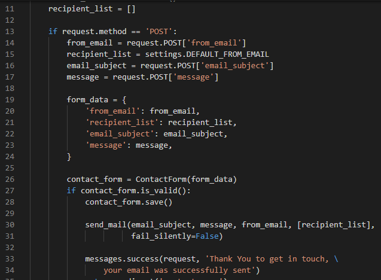
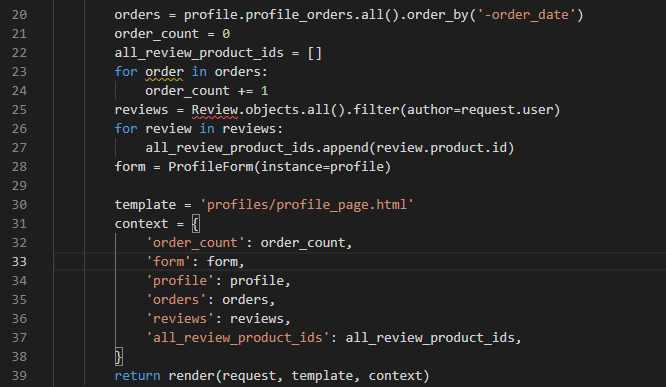
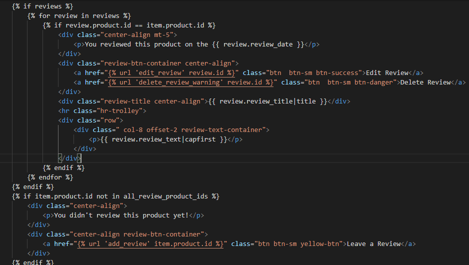

## bugs found

1. Using the function send_mail the recipient_list value gives an error. Require a tuple or a list.

1. The solution for this problem is to add a square bracket for the recipient list value  

 

---

1. On the checkout page, the checkout_completed doesn't have a security/login check to view the order.
    * if after the checkout_completed screen refresh the page, the checkout form is submitted again and another email is sent to the user. Also if the user copies and paste the checkout_success page URL can see the checkout_completed page and the order is submitted again, also another email is sent.
    * the issue is that no login should be required to see the checkout_completed page so the unregistered user can still buy products from the website and see the checkout_completed page as a guest.

    * to replicate the behaviour:
        1. navigate to https://original-crafts.herokuapp.com/
        1. click on one product
        1. add the product to the trolley
        1. proceed to the checkout
        1. fill the form and the payment information
        1. click on complete order
        1. refresh the page - the email has been sent again and the order was created again
        1. copy the URL page
        1. exit the website
        1. paste the URL in the browser
        1. press enter - the email has been sent again and the order was created again

1. Solution found:
    * Added a new field - email_sent - to the checkout_order model
    * The default value of email sent is set to False
    * after the email is sent the code will assign email_sent True value
    * the guest user will be able to view the checkout_completed page only once and if try to access it again will be redirected to the homepage
    * the registered user can access the checkout_completed page from the order history in the profile page but the code will not duplicate the order. Also, a message will be displayed to show the user the date the order was created  

    ---

1. In the order history below each product in the order there are the review buttons:
    * if the user reviewed the product two buttons will be displayed:
        Edit Review  
        Delete Review 

    * if the user didn't review the product yet a button Add Review is displayed  

1. When the code is going through all the reviews to check if that user review that product the buttons are displayed for each loop.

1. I solved the problem by adding a variable in the profile_page view called all_review_product_ids and using a for loop first to check if the product has been reviewed already by the user, followed by an if statement to check if the all_reviews_product_ids has a value, if not display the message 'you didn't review this product yet' and display the Add Review button.

### profile_page view in profiles.views.py  
   

### profile_page template   
  